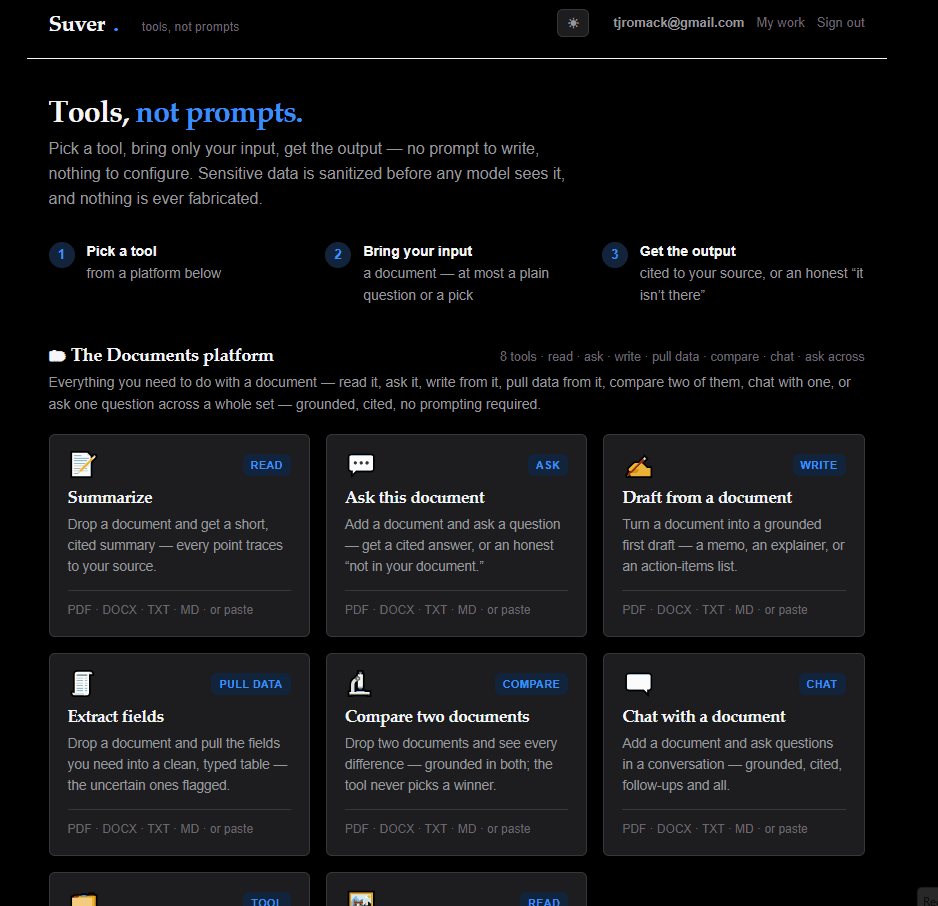

# Suver

> © 2026 Trevor J. Romack — **source-available for review, not open-source** ([LICENSE](LICENSE)). No reuse or
> commercial use without permission. · Built by Trevor Romack · tjromack@gmail.com

**An AI tool hub that removes the prompt.** Pick a tool, bring only your input, get the output — no prompt to write,
nothing to configure. Every answer is cited to *your* source or the tool honestly says it can't, and sensitive data
is sanitized before any model sees it.

### ▶️ Try it live — **[suver-demo.onrender.com](https://suver-demo.onrender.com)**
No signup. Open any tool and click **✨ Try an example** for a real, cited result in one click.
*(It's a free-tier host — if it's asleep, the first click takes ~30 seconds to wake.)*

**Prefer the short version?** Read the [1-page case study](https://claude.ai/code/artifact/df32c8dc-d1da-4b38-98c6-f9f520253002).



*Above: the **abstention** beat in "Ask this document" — the behavior a regulated buyer asks about first, and almost no
demo shows. When the fact isn't in your source, Suver says so rather than inventing one.*

---

## Why Suver is different
Most AI tools hand you a blank chat box and hope you know how to prompt it — and hope it doesn't make something up.
Suver fixes both:

- **No prompt to write.** Each tool does one job. Bring a document, a spreadsheet, or a message; get exactly the
  output you came for.
- **Never a confident fabrication.** Every claim is grounded to a span of *your* source and cited — or it's withheld.
  The tools **abstain instead of guessing.**
- **Safe on sensitive data.** PII/PHI is detected and tokenized **locally, before** anything reaches a model, then
  re-hydrated only in your view.
- **Trust you can measure.** A labeled evaluation scores the product on the real model — **20/20: 0 hallucinations,
  0 fabrications** — and re-runs on your own documents.

## The tools — 16 across 4 platforms

**📄 Documents** — *read · ask · write · pull data · compare · chat · ask across · read an image*
- **Summarize** — a cited summary; unsupported points are withheld, never shown as trusted.
- **Ask this document** — a grounded, cited answer, or an honest "not in your document."
- **Draft** — pick a kind → a grounded memo; a section that can't be grounded is blocked, never faked.
- **Extract fields** — a typed table; uncertain values are flagged, never quietly guessed.
- **Compare two documents** — every difference, type-aware, grounded in both — the tool never picks a winner.
- **Chat with a document** — multi-turn, grounded, follow-ups and all.
- **Ask across your documents** — one question over a whole set → one cited answer **per document**, so a fact from
  one can never contaminate another's.
- **Read an image** — drop a receipt, form, or screenshot → a faithful transcription. Because you can't tokenize PII
  inside pixels, it's **transparent** that the image is sent as-is, and the data boundary runs on the *output* —
  flagging any sensitive items and offering a sanitized copy.

**✉️ Communications** — *sort inbound · draft outbound · extract from meetings*
- **Meeting notes → actions** — action items (who · what · by when), grounded; owner/due only if actually stated.
- **Triage messages** — each sorted (Needs reply · Action · FYI · Ignore); ambiguous ones flagged, never forced.
- **Draft a reply** — a grounded reply that leaves **[placeholders]** for the unknown and never invents specifics.

**📊 Data & Analysis** — *ask · summarize · chart* — the model plans, **the code computes**, so the numbers are always right
- **Ask your spreadsheet** — an exact answer computed from your rows, showing the cells it used.
- **Summarize a spreadsheet** — a plain-language overview + a computed column profile; every figure calculated, not invented.
- **Chart your spreadsheet** — bar charts totalled by category, computed locally (no model call at all).

**🎓 Learning** — *turn a document into study material*
- **Flashcards** — Q&A study cards, each answer **cited to your text**; a card that can't be grounded is dropped, never
  invented. Flip-to-reveal, and export a deck (CSV — Anki/Quizlet-importable).
- **Quiz me** — multiple-choice questions; every correct answer is **cited to your document**.

## Trust, measured — not asserted
`python -m eval.run` grades a labeled set on the real model across four categories — answerable (recall), unanswerable
(abstention), adversarial (no-fabrication / no cross-document contamination), and sensitive (PII handled). Current
scorecard (`eval/SCORECARD.md`):

> **20/20 — recall 6/6 · abstention 5/5 · no-fabrication 5/5 · PII-handled 4/4 · 0 hallucination incidents · 0 fabrication incidents.**

It re-runs on any corpus, so the trust claim can be reproduced on your own documents.

**Where it bends — the hard set.** A deliberately-messy set (`python -m eval.run_hard`: superseded facts, OCR noise,
tables, distractor-dense unanswerables, near-duplicate documents, paraphrase gaps) pushes it until something fails —
~7/9, with a **published error analysis** ([`eval/FINDINGS-HARD.md`](eval/FINDINGS-HARD.md)). The finding that matters:
**every miss is over-caution or over-generalization — 0 fabrications, 0 confident wrong citations** on either set.
Two "failures" turned out to be the *checks*, not the model (a mislabeled metric; a brittle grader) — and the
re-ranker that fixes a retrieval miss re-introduces an over-generalization elsewhere, which is why it ships off by
default. An honest picture beats a clean sweep.

## How it's built
One reusable, no-prompt **shell + hub**, with the trust machinery shared by every tool:

> **ingest → sanitize → retrieve/split → draft (LLM) → ground (cite-or-abstain) → re-hydrate → show**

The model only ever sees sanitized text; sanitizing, splitting, and grounding are deterministic and never call a model.
New verticals (legal, healthcare, finance) are added by **configuration, not forks**. Retrieval quality is tunable — an
optional LLM re-ranker lifts recall **without touching the grounding gate** — and a 👍/👎 feedback → review queue lets
the tools learn from real use, **privacy by design** (it stores no document or answer content). Accounts + saved work,
per-user usage quotas & tiers (so a public instance can't run up the API bill), and a Docker deploy are included.

**Stack:** Python · FastAPI · Jinja/HTMX · SQLite · Docker · Claude (real model) with an offline stub for deterministic
tests · a **225-test** suite. Synthetic/public data only in this repo; the product runs on your real documents.

## Run it locally
```bash
python -m venv .venv
# activate the venv:
source .venv/bin/activate        # macOS / Linux
# .venv\Scripts\activate         # Windows (PowerShell)

python -m pip install -r requirements.txt
python -m uvicorn app.main:app --port 8000     #  → http://127.0.0.1:8000
python -m pytest -q                            #  225 tests (offline stub, no key needed)
```
No key needed for the steps above — the test suite and the UI run fully offline on a deterministic stub. For the **real
model**, set `PROVIDER=anthropic` and `ANTHROPIC_API_KEY` in a `.env` file, then re-run. To stand up your own hosted
instance, see [`DEPLOY.md`](DEPLOY.md).

*(Windows without activating: swap `python` for `.venv\Scripts\python`. macOS/Linux without activating: `.venv/bin/python`.)*

## Demonstrates
**Grounded generation with cite-or-abstain** — every claim is attributed to a span of *your* source or withheld, and
sensitive data is tokenized before egress. Verified by a labeled real-model eval, not asserted.

## What Suver does *not* do
It is **not** a legal, clinical, or financial adviser, and it does **not** decide anything for you — it retrieves,
grounds, and cites, and abstains when your source doesn't support an answer. It won't summarize the open web, act as a
general chatbot, or "fill in" a fact that isn't in the document you gave it.

## Limits & boundaries
Stated plainly, because the boundary is the product:

- **Synthetic / public data only in this repo.** Every document under `data/` and in `eval/` is invented or public.
  No real client data, ever. The product runs on *your* documents; this repository does not contain any.
- **Not a certified system.** The 20/20 scorecard is a measurement on a **labeled 20-case set on the real model**
  (`python -m eval.run`), not a guarantee, a benchmark, or a compliance certification. Reproduce it on your own
  documents before you trust it on them.
- **The sanitization boundary — exact scope.** PII/PHI is detected locally and tokenized *before* any text reaches a
  model, then re-hydrated only in your view (`app/_engines/boundary/`). It is **recall-first**: it over-redacts rather
  than under-redacts.
  - **Detected & tokenized:** SSN · credit-card-like numbers (13–19 digits, flagged even if Luhn-invalid) · MRN (the id
    after an `MRN:` marker) · email · US-format phone · dates / DOB · person names (a gazetteer of common first names +
    an adjacent capitalized surname) · US-style street address.
  - **Known to pass through** (stated honestly): names outside the gazetteer or with unusual capitalization; non-US or
    unusually-formatted addresses; and identifier types **not modeled** — passport, driver's license, bank
    account/routing, IP address, and national IDs other than SSN. Name/address detection is heuristic, not NER-complete.
  - **Trade-off:** recall-first means occasional over-redaction (e.g., a long order number may be tokenized). That is
    deliberate — for a trust boundary, a false positive is cheap and a miss is not.
- **Scope of the trust claim.** "Never a confident fabrication" is enforced by the grounding gate and *measured* on the
  labeled set; it is not a claim that every possible input has been tested.

## License
**Source-available for review — not open-source.** © 2026 Trevor J. Romack. All rights reserved; no reuse or commercial
use without permission (see [`LICENSE`](LICENSE)). Licensing inquiries: tjromack@gmail.com
